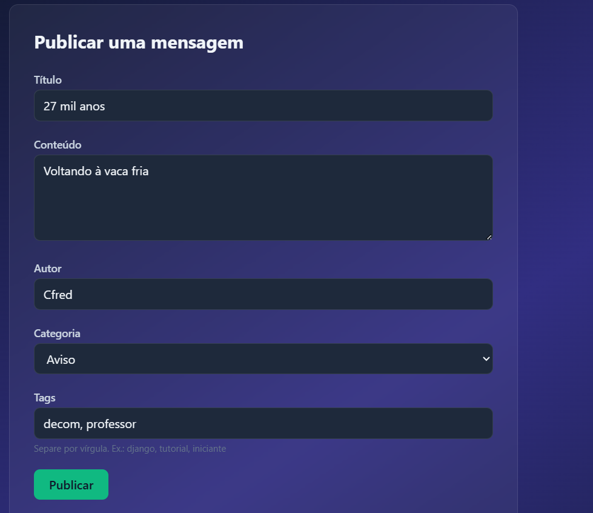
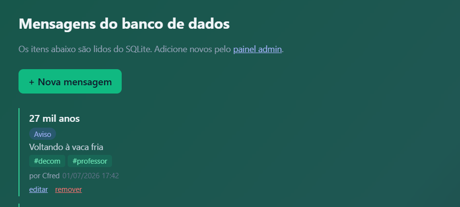
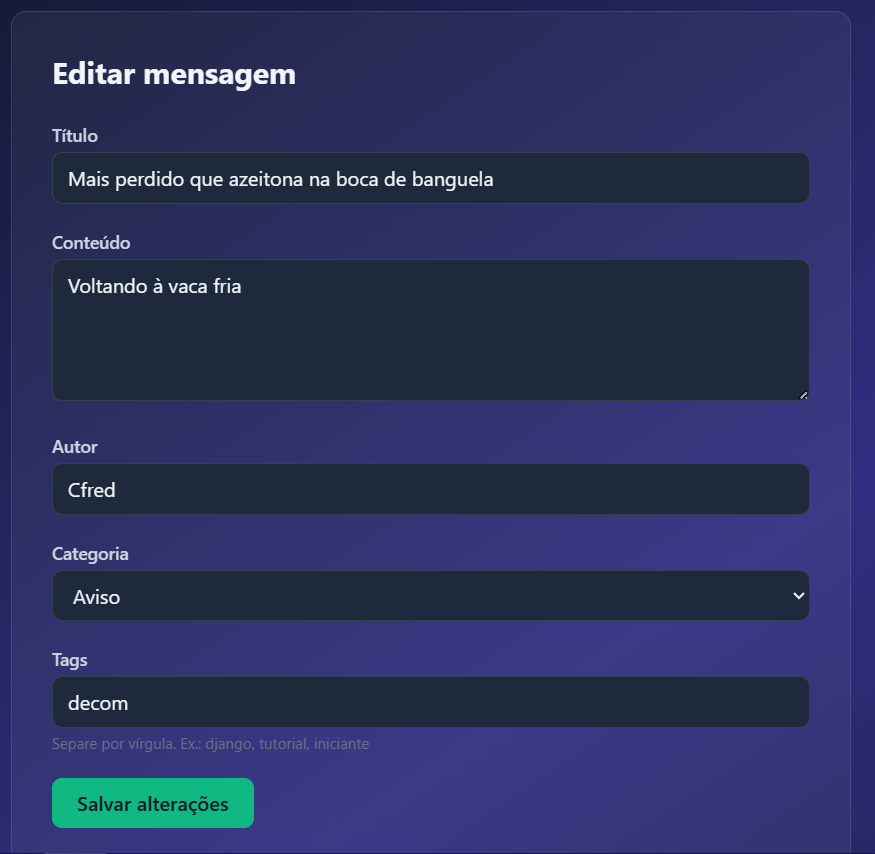
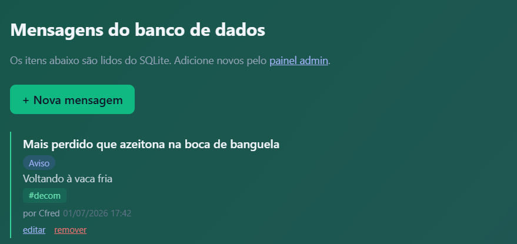
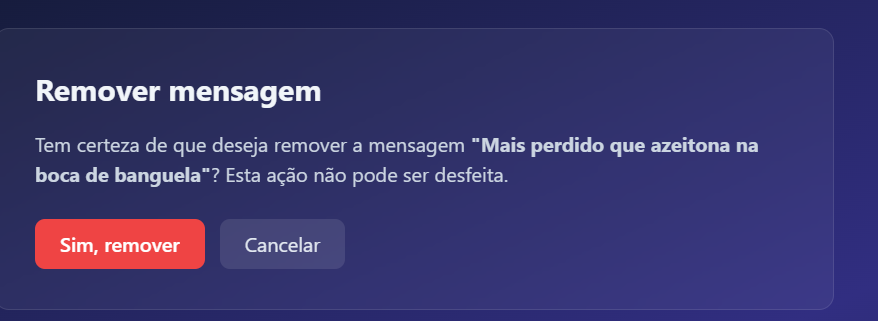
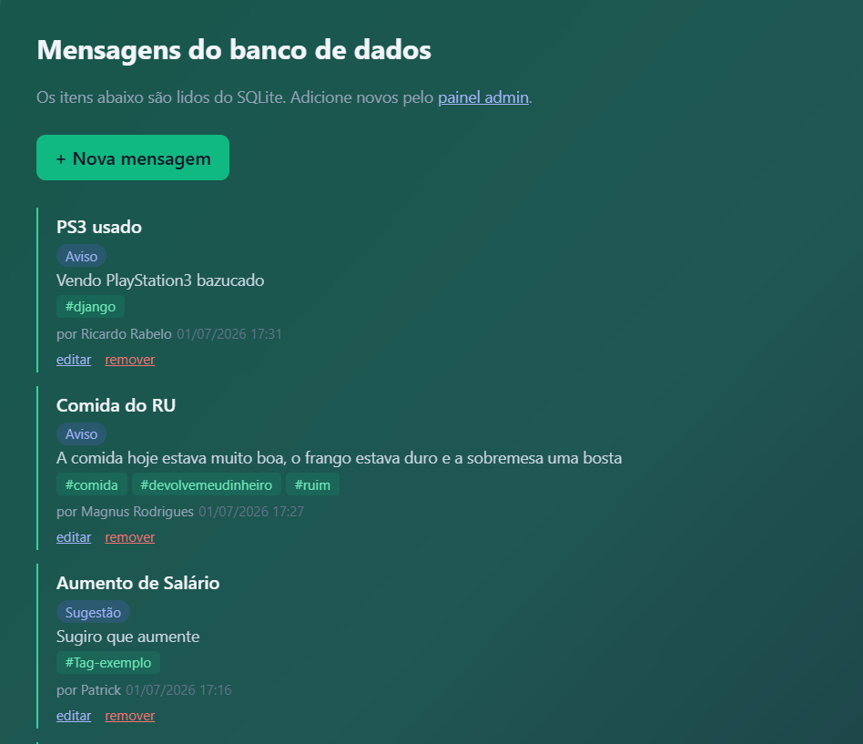

# Roteiro 6 Django
README referente à parte 6 dos roteiros do projeto django da disciplina de Programação Web

## Imagens
### Create:

### Read:

### Update:

### Confirmando update:

### Delete:

### Confirmando delete:
